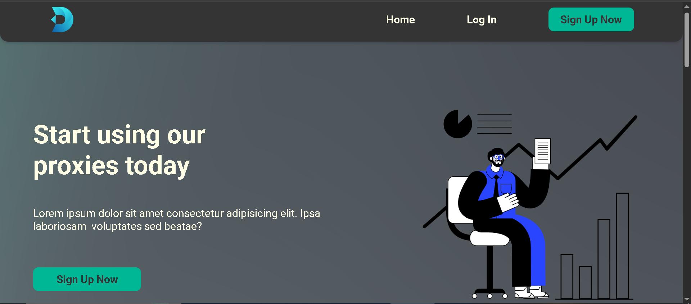
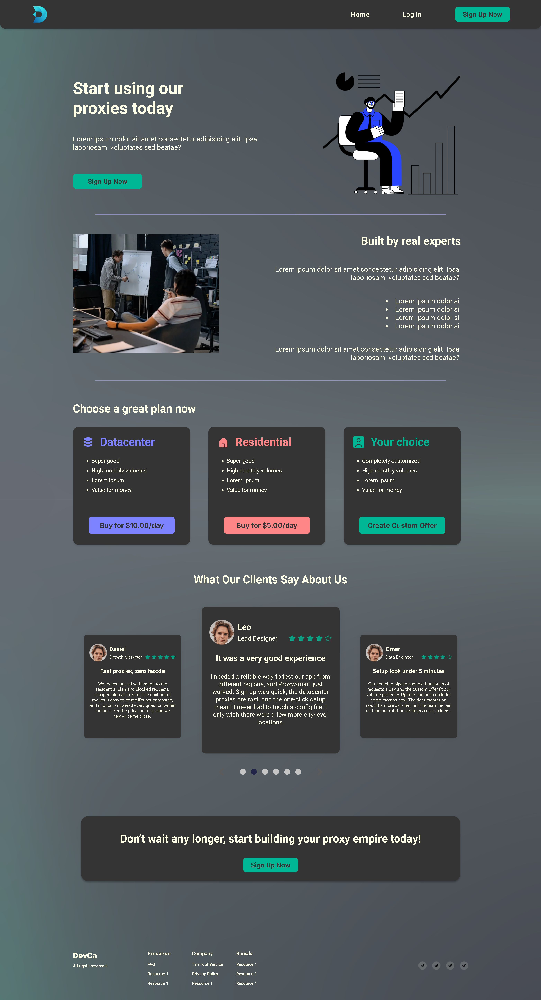
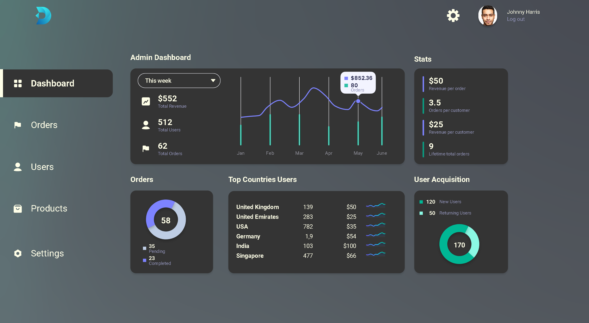

# Proxy Generator Dashboard

A modern, fully responsive **proxy generator platform** built with **React, Vite and Tailwind CSS** — including a public marketing website and a complete **admin dashboard**.

This project started as a freelance design and was rebuilt from scratch as a pixel-accurate React application, converted from a multi-page Figma design.

🔗 **Live Demo:** [Coming soon](#)

   

---

## ✨ Features

- **Pixel-accurate UI** — built to match the original Figma design at 1440px
- **Fully responsive** — layouts adapt cleanly from desktop down to mobile
- **Two separate layouts** — website (Header + Footer) and admin panel (Sidebar + Topbar)
- **Client-side routing** with React Router and active link highlighting
- **Reusable component system** — buttons, cards, containers, tables and more
- **Data-driven content** — all text, plans and testimonials live in data files, so content can be changed without touching components
- **Custom design tokens** — brand colors and fonts configured in the Tailwind theme

---

## 🛠 Tech Stack

| Technology | Purpose |
|---|---|
| [React](https://react.dev/) | UI library |
| [Vite](https://vitejs.dev/) | Build tool & dev server |
| [Tailwind CSS v4](https://tailwindcss.com/) | Styling |
| [React Router](https://reactrouter.com/) | Page routing |
| ESLint | Code quality |

---

## 📄 Pages

### Website
<!-- Update these names to match your pages -->
| Page | Route |
|---|---|
| Home | `/` |
| About | `/about` |
| Pricing | `/pricing` |
| Contact | `/contact` |

### Admin Dashboard
<!-- Update these names to match your admin pages -->
| Page | Route |
|---|---|
| Dashboard | `/admin` |
| Users | `/admin/users` |
| Settings | `/admin/settings` |

---

## 📁 Project Structure

```
src/
├── pages/
│   ├── Home.jsx ...          # Website pages
│   └── admin/                # Admin dashboard pages
├── components/
│   ├── layout/               # MainLayout, Header, Footer
│   ├── admin/                # AdminLayout, Sidebar, Topbar, admin widgets
│   ├── home/                 # Home page sections
│   └── ui/                   # Reusable UI components
├── data/                     # Page content & dummy data
├── assets/                   # Images & icons
├── App.jsx                   # Routes
└── main.jsx
```

---

## 🚀 Getting Started

### Prerequisites
- [Node.js](https://nodejs.org/) (v18 or higher)

### Installation

```bash
# Clone the repository
git clone https://github.com/Zeeshan-dev-source/proxy-generator-dashboard.git

# Go into the project folder
cd proxy-generator-dashboard

# Install dependencies
npm install

# Start the development server
npm run dev
```

Open [http://localhost:5173](http://localhost:5173) in your browser.
The admin dashboard is available at [http://localhost:5173/admin](http://localhost:5173/admin).

### Available Scripts

| Command | Description |
|---|---|
| `npm run dev` | Start the development server |
| `npm run build` | Build for production |
| `npm run preview` | Preview the production build |
| `npm run lint` | Run ESLint |

---

## 📸 Screenshots

| Home | Admin Dashboard |
|---|---|
|  |  |

---

## 🔮 Future Improvements

- Backend integration and real proxy generation
- Authentication with protected admin routes
- Dark mode

---

## 👤 Author

**Zeeshan Ahmad**
GitHub: [@Zeeshan-dev-source](https://github.com/Zeeshan-dev-source)
